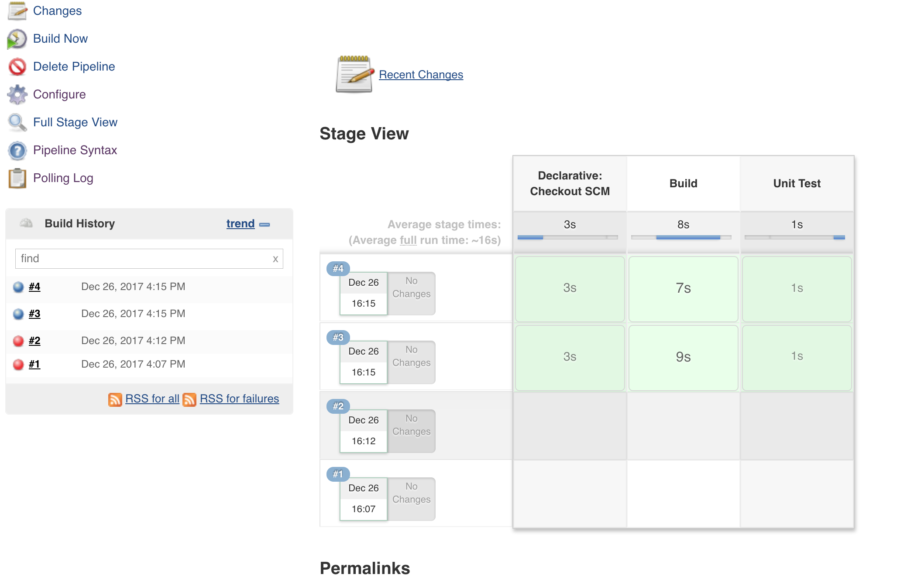

### JENKINS PIPELINE AS CODE ###

* Download and install Jenkins from https://jenkins.io/download/
* Start Jenkins at http://localhost:8080/
* Configure the initial setup
* Create a new item > select Pipeline
  

* Add pipeline script definition as "Pipeline script from SCM" > choose SCM and provide Details > Apply
  

* Build Now to see the pipeline configured
  
